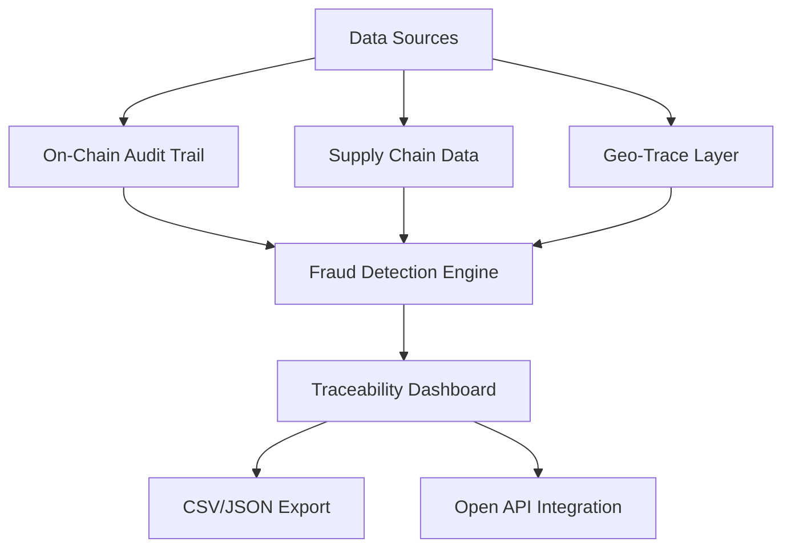

# RANTAI Trace

RANTAI Trace adalah platform traceability berbasis blockchain yang memungkinkan pelacakan jejak karbon, sertifikasi keberlanjutan, dan atribut rantai pasok multi-asset secara transparan dan immutable. Sistem ini mendukung integrasi data multi-industri dari produksi sampai konsumsi akhir.

---

## Core Features

- 🔗 On-Chain Audit Trail – lacak hash transaksi, kontrak, dan peristiwa blockchain.

- 📦 Supply Chain Data Integration – gabungkan data logistik, inventori, dan dokumen pengiriman.

- 🌍 Geo-Trace Layer – visualisasi perjalanan barang melalui peta interaktif.

- 🛡️ Fraud Prevention – mendeteksi anomali pada distribusi/penyimpangan rantai pasok.

- 📑 Export & API – data siap diekspor ke CSV/JSON atau diakses via API untuk sistem eksternal.

---

## Flow Diagram

---

## Kontribusi

Kontribusi sangat kami sambut! Silakan ikuti langkah berikut:

- Fork repository

- Buat branch fitur baru: git checkout -b feature/nama-fitur

- Commit perubahan Anda: git commit -m 'Tambah fitur baru'

- Push ke branch Anda: git push origin feature/nama-fitur

- Buat pull request di repository ini

- Harap pastikan kode teruji dan mengikuti style yang sudah ada.

---

## Lisensi

Proyek ini dilisensikan di bawah MIT License - baca file LICENSE untuk informasi lebih lanjut.
